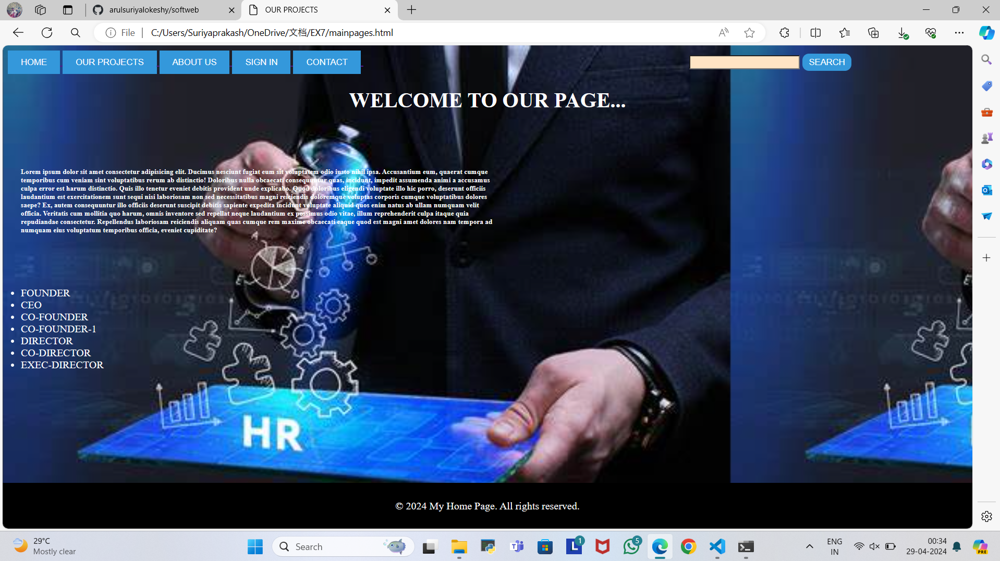
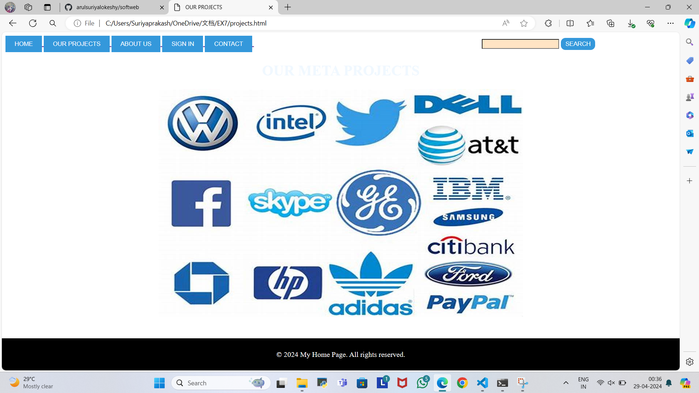
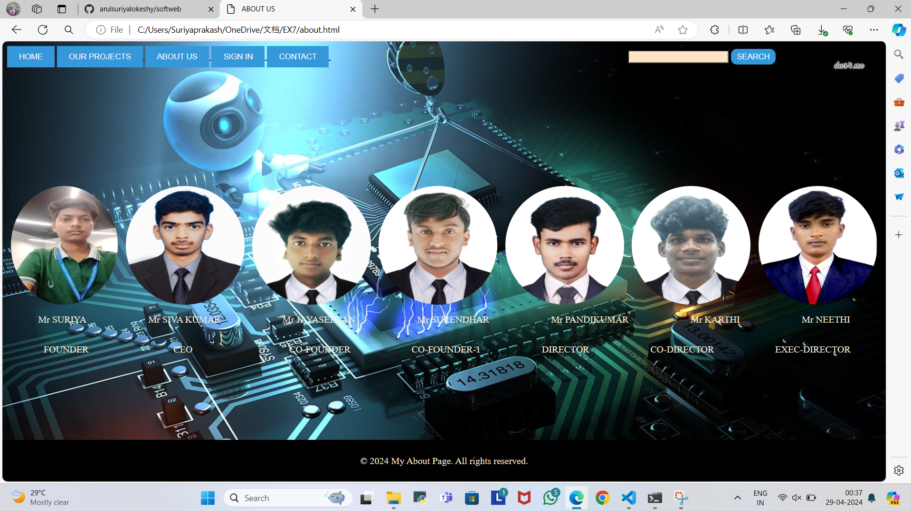
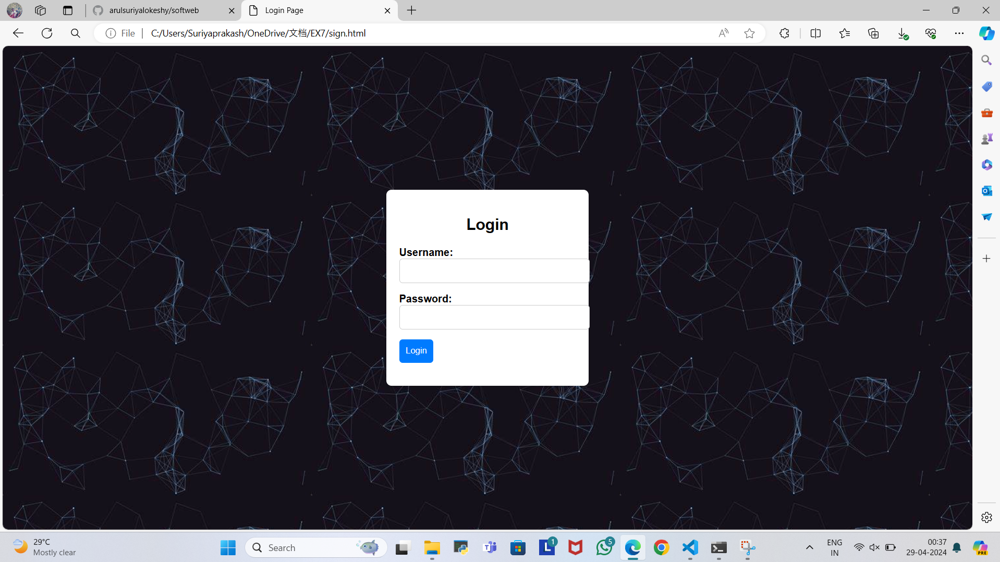
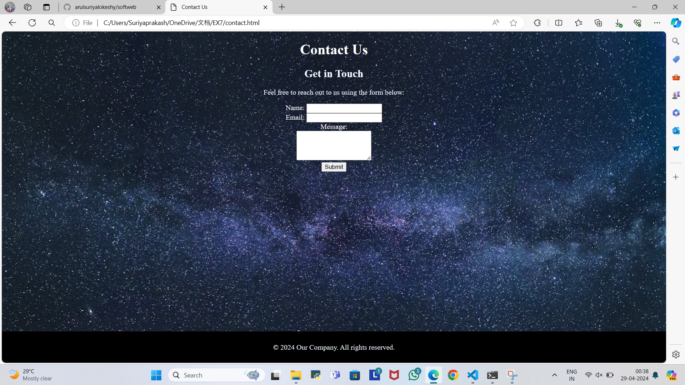

# Ex.07 Software Product Company Website
## Date:

## AIM:
To develop a static company website to display the softwares and services provided by the company.

## DESIGN STEPS:

### Step 1:
Requirement collection.

### Step 2:
Creating the layout using HTML and CSS.

### Step 3:
Updating the sample content.

### Step 4:
Choose the appropriate style and color scheme.

### Step 5:
Validate the layout in various browsers.

### Step 6:
Validate the HTML code.

### Step 7:
Publish the website in the given URL.

## PROGRAM:
```
home.html
<html>
    <title>OUR PROJECTS</title>
    <style> 
        .footer {
            position: fixed;
            left: 0;
            bottom: 0;
            width: 100%;
            background-color:black;
            color: #fff;
            text-align: center;
            padding: 10px 0;
        }
         
    body{
        background:url(12.jpeg);
        background-size:contain;
    } 
    .container {
        width: 50%; /* Adjust width as needed */
        float: left; /* Float the container to the left */
        padding: 20px; /* Optional: Add padding for spacing */
    }
    
    .h1{
        color: aliceblue;
    }  
    .styled form {
            margin margin-top: 20px;
            display: flex;
            justify-content: space-between;
        }
        .styled [type="button"] {
            padding: 10px 20px; /* button size */
            background-color: #3498db; /* initial background color */
            color: #ffffff; /*initial text color */
            border: none;
            transition: background-color 0.3s, color 0.3s; /*smooth transition */
        }
        .styled [type="button"]:hover {
            background-color:purple; /*background color on hover */
            color:aliceblue; /*text color on hover */
        }
        .styled [type="submit"] {
            border-radius: 10px;
            padding: 5px 10px; /* button size */
            background-color: #3498db; /* initial background color */
            color: #ffffff; /*initial text color */
            border: none;
            transition: background-color 0.3s, color 0.3s; /*smooth transition */
        }
        .styled [type="submit"]:hover {
            background-color:purple; /*background color on hover */
            color:#ffffff; /*text color on hover */
        }
        .styled [type="text"] {
            margin-left: 500px;
            transition: background-color 0.3s; 
            background-color:bisque;
        }
        .styled input[type="text"]:focus {
    /* Change background color when input is focused */
    background-color:rgb(224, 127, 224); /* Adjust the color as needed */
}
</style>
    
    <body>
        <form class="styled ">
            <div class=>
                <a href="mainpages.html">
                    <input type="button" value="HOME">
                </a>
                <a href="projects.html">
                    <input type="button" value="OUR PROJECTS">
                </a>
                <a href="about.html">
                    <input type="button" value="ABOUT US">
                </a>
                <a href="sign.html">
                    <input type="button" value="SIGN IN">
                </a>
                <a href="contact.html">
                    <input type="button" value="CONTACT">
                </a>  
                <input type="text">
                <input type="submit"value="SEARCH">  
            </div>
        </form>
        
        <center>
         <h1 style="color: #ffffff;">WELCOME TO OUR PAGE...</h1><br>
         
    </center>
         <h6 class="container" style="color: #ffffff;"> <b>Lorem ipsum dolor sit amet consectetur adipisicing elit. Ducimus nesciunt fugiat eum sit voluptatem odio iusto nihil ipsa. Accusantium eum, quaerat cumque temporibus cum veniam sint voluptatibus rerum ab distinctio! Doloribus nulla obcaecati consequuntur quas, incidunt, impedit assumenda animi a accusamus culpa error est harum distinctio. Quis illo tenetur eveniet debitis provident unde explicabo. Quod doloribus eligendi voluptate illo hic porro, deserunt officiis laudantium est exercitationem sunt sequi nisi laboriosam non sed necessitatibus magni reiciendis doloremque voluptas corporis cumque voluptatibus dolores saepe? Ex, autem consequuntur illo officiis deserunt suscipit debitis sapiente expedita incidunt voluptate aliquid quos enim natus ab ullam numquam velit officia. Veritatis cum mollitia quo harum, omnis inventore sed repellat neque laudantium ex possimus odio vitae, illum reprehenderit culpa itaque quia repudiandae consectetur. Repellendus laboriosam reiciendis aliquam quas cumque rem maxime obcaecati eaque quod est magni amet dolores nam tempora ad numquam eius voluptatum temporibus officia, eveniet cupiditate? </b></h6> <br>

         <ul class="container" style="color: #ffffff;">
            <li>FOUNDER</li>
            <li>CEO</li>
            <li>CO-FOUNDER</li>
            <li>CO-FOUNDER-1</li>
            <li>DIRECTOR</li>
            <li>CO-DIRECTOR</li>
            <li>EXEC-DIRECTOR</li>
         </ul>

         <footer class="footer">
            <p>&copy; 2024 My Home Page. All rights reserved.</p>
        </footer>


    </body>

   
    
</html>


```
```
project.html

<html>
    <title>OUR PROJECTS</title>
    <style>  
        .footer {
            position: fixed;
            left: 0;
            bottom: 0;
            width: 100%;
            background-color:black;
            color: #fff;
            text-align: center;
            padding: 10px 0;
        }
    body{
        background:url(product.jpg);
        background-size:contain;
    } 
    h1{
        color: aliceblue;
    }  
    .styled form {
            margin margin-top: 20px;
            display: flex;
            justify-content: space-between;
        }
        .styled [type="button"] {
            padding: 10px 20px; /* button size */
            background-color: #3498db; /* initial background color */
            color: #ffffff; /*initial text color */
            border: none;
            transition: background-color 0.3s, color 0.3s; /*smooth transition */
        }
        .styled [type="button"]:hover {
            background-color:purple; /*background color on hover */
            color:aliceblue; /*text color on hover */
        }
        .styled [type="submit"] {
            border-radius: 10px;
            padding: 5px 10px; /* button size */
            background-color: #3498db; /* initial background color */
            color: #ffffff; /*initial text color */
            border: none;
            transition: background-color 0.3s, color 0.3s; /*smooth transition */
        }
        .styled [type="submit"]:hover {
            background-color:purple; /*background color on hover */
            color:#ffffff; /*text color on hover */
        }
        .styled [type="text"] {
            margin-left: 500px;
            transition: background-color 0.3s; 
            background-color:bisque;
        }
        .styled input[type="text"]:focus {
    /* Change background color when input is focused */
    background-color:rgb(224, 127, 224); /* Adjust the color as needed */
}
</style>
    
    <body>
        <form class="styled ">
            <div class=>
                <a href="mainpage.html">
                    <input type="button" value="HOME">
                </a>
                <a href="projects.html">
                    <input type="button" value="OUR PROJECTS">
                </a>
                <a href="about.html">
                    <input type="button" value="ABOUT US">
                </a>
                <a href="sign.html">
                    <input type="button" value="SIGN IN">
                </a>
                <a href="contact.html">
                    <input type="button" value="CONTACT">
                </a>  
                <input type="text">
                <input type="submit"value="SEARCH">  
            </div>
        </form>
        
        <center>
            <h1 >OUR META PROJECTS</h1>
        
    </center>
    <footer class="footer">
        <p>&copy; 2024 My Home Page. All rights reserved.</p>
    
    </footer>
    </body>
    
</html>
```
```
about.html
<html>
<title>ABOUT US</title>
<style>
    .footer {
        position: fixed;
        left: 0;
        bottom: 0;
        width: 100%;
        background-color:black;
        color: #fff;
        text-align: center;
        padding: 10px 0;
    }
    p{
        color: antiquewhite;
    }
    body{
        background:url(8.jpg);
        background-size: cover;
    }
    .styled form {
            margin margin-top: 20px;
            display: flex;
            justify-content: space-between;
        }
        .styled [type="button"] {
            padding: 10px 20px; /* button size */
            background-color: #3498db; /* initial background color */
            color: #ffffff; /*initial text color */
            border: none;
            transition: background-color 0.3s, color 0.3s; /*smooth transition */
        }
        .styled [type="button"]:hover {
            background-color:purple; /*background color on hover */
            color:aliceblue; /*text color on hover */
        }
        .styled [type="submit"] {
            border-radius: 10px;
            padding: 5px 10px; /* button size */
            background-color: #3498db; /* initial background color */
            color: #ffffff; /*initial text color */
            border: none;
            transition: background-color 0.3s, color 0.3s; /*smooth transition */
        }
        .styled [type="submit"]:hover {
            background-color:purple; /*background color on hover */
            color:#ffffff; /*text color on hover */
        }
        .styled [type="text"] {
            margin-left: 500px;
            transition: background-color 0.3s; 
            background-color:bisque;
        }
        .styled input[type="text"]:focus {
    /* Change background color when input is focused */
    background-color:rgb(224, 127, 224); /* Adjust the color as needed */
}
.photos{
    display:flex;
    justify-content: space-around;
    margin-top: 200px;
}
.names{
    display:flex;
    justify-content: space-around;

}
.position {
    display: flex;
    justify-content: space-around;
    margin-left: 10px;
    border-image:5px;
    border-image: antiquewhite;
}

</style>
<body>
    <form class="styled ">
        <div class=>
            <a href="mainpages.html">
                <input type="button" value="HOME">
            </a>
            <a href="projects.html">
                <input type="button" value="OUR PROJECTS">
            </a>
            <a href="about.html">
                <input type="button" value="ABOUT US">
            </a>
            <a href="sign.html">
                <input type="button" value="SIGN IN">
            </a>
            <a href="contact.html">
                <input type="button" value="CONTACT">
            </a>  
            <input type="text">
            <input type="submit"value="SEARCH">  
        </div>
    </form>
    <div class="photos">
    
    
    
    
    
    
    
</div>
<div CLASS="names">
    <P>Mr SURIYA</P>    
    <P >Mr SIVA KUMAR</P>    
    <P>Mr JAYASEELAN</P>    
    <P>Mr SURENDHAR</P>    
    <P>Mr PANDIKUMAR</P>    
    <P>Mr KARTHI</P>    
    <P>Mr NEETHI</P>    
</div>
<DIV class="position">
    <p>FOUNDER </p>
    <p style="margin-left:40;">CEO </p>
    <p style="margin-left:60;">CO-FOUNDER </p>
    <p>CO-FOUNDER-1 </p>
    <p>DIRECTOR </p>
    <p >CO-DIRECTOR</p>
    <p>EXEC-DIRECTOR </p>

</DIV>
</body>
<footer class="footer">
    <p>&copy; 2024 My About Page. All rights reserved.</p>
    
</footer>
</html>
```
```
sign.html
<!DOCTYPE html>
<html lang="en">
<head>
<meta charset="UTF-8">
<meta name="viewport" content="width=device-width, initial-scale=1.0">
<title>Login Page</title>
<style>
  body {
    font-family: Arial, sans-serif;
    background-color: #f4f4f4;
    margin: 0;
    padding: 0;
    display: flex;
    justify-content: center;
    align-items: center;
    height: 100vh;
    background-image:url(10.jpeg);
  }

  .login-container {
    background-color: #fff;
    padding: 20px;
    border-radius: 8px;
    box-shadow: 0 4px 8px rgba(0, 0, 0, 0.1);
  }

  .login-container h2 {
    text-align: center;
    margin-bottom: 20px;
  }

  .login-form {
    display: flex;
    flex-direction: column;
  }

  .form-group {
    margin-bottom: 15px;
  }

  .form-group label {
    font-weight: bold;
  }

  .form-group input {
    width: 100%;
    padding: 10px;
    border: 1px solid #ccc;
    border-radius: 5px;
  }

  .form-group button {
    padding: 10px;
    border: none;
    border-radius: 5px;
    background-color: #007bff;
    color: #fff;
    cursor: pointer;
  }
</style>
</head>
<body>

<div class="login-container">
  <h2>Login</h2>
  <form class="login-form" action="#" method="post">
    <div class="form-group">
      <label for="username">Username:</label>
      <input type="text" id="username" name="username" required>
    </div>
    <div class="form-group">
      <label for="password">Password:</label>
      <input type="password" id="password" name="password" required>
    </div>
    <div class="form-group">
      <button type="submit">Login</button>
    </div>
  </form>
</div>

</body>
</html>

```
```
contact.html
<!DOCTYPE html>
<html lang="en">
<head>
    <meta charset="UTF-8">
    <meta name="viewport" content="width=device-width, initial-scale=1.0">
    <title>Contact Us</title>
    <link rel="stylesheet" href="styles.css"> <!-- Optional: Link to an external stylesheet for styling -->
   <style> .footer {
        position: fixed;
        left: 0;
        bottom: 0;
        width: 100%;
        background-color:black;
        color: #fff;
        text-align: center;
        padding: 10px 0;
    }
    body{
        background:url(15.jpeg);
        background-size: cover;
    }
    .h1,h2,p{
        color: aliceblue;
    }

</style>
</head>
<body>
    <center><header>
        <h1 style="color: #fff;">Contact Us</h1>
    </header>

    <div class="content">
        <h2>Get in Touch</h2>
        <p>Feel free to reach out to us using the form below:</p>
        
        <form action="#" method="POST" >
            <label for="name" style="color: #fff;">Name:</label>
            <input type="text" id="name" name="name" required><br>
            
            <label for="email" style="color: #fff;">Email:</label>
            <input type="email" id="email" name="email" required><br>
            
            <label for="message" style="color: #fff;">Message:</label><br>
            <textarea id="message" name="message" rows="4" required></textarea><br>
            
            <input type="submit" value="Submit">
        </form>
    </div>

    <footer class="footer" >
        <p>&copy; 2024 Our Company. All rights reserved.</p>
    </footer>
    
</center>
</body>
</html>

```

## OUTPUT:







## RESULT:
The program for designing software company website using HTML and CSS is completed successfully.
